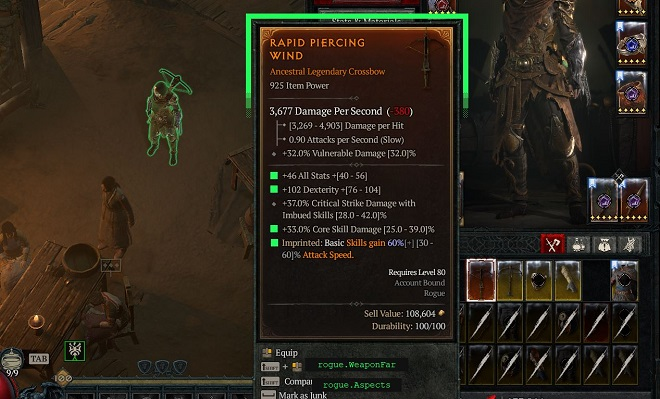

# 

\*\*\* Note: D4LF will be supported for Season 13. However, there were a lot of itemization updates and it may take a few weeks for all the bugs to get ironed out. \*\*\*

Filter items and sigils in your inventory based on affixes, aspects and thresholds of their values. For questions,
feature request or issue reports join the [discord](https://discord.gg/YyzaPhAN6T) or use github issues.



## Features

- Filter items in inventory and stash
- Filter by item type, item power and greater affix count
- Filter by affix and their values, with per-affix greater affix requirements
- Filter uniques by their affix and aspect values
- Filter sigils by blacklisting and whitelisting locations and affixes
- Filter tributes by name or rarity
- Automatically marks all common, magic, and optionally rare gear as junk
- Quickly move items from your stash or inventory
- Supported resolutions are all aspect ratios between 16:10 and 21:9
- Paragon Overlay with import from supported build planners (Mobalytics, Maxroll, D4Builds)

## How to Setup

### Installation and quick start guide (New instructions for season 12 that must be followed!)

- Download and extract the latest version (.zip) from the releases: https://github.com/d4lfteam/d4lf/releases
- Find your "Diablo IV" directory. Copy the path and have it in your clipboard:
  - In Battle.net, click the gear icon next to the Play button and select "Open in Explorer"
  - In Steam, right click the game, select Manage > Browse local files
- D4LF gets item information by reading the screen and using TTS information sent for accessibility. TTS setup takes additional steps, detailed below. For more information on the install_dll.cmd script, see [the TTS section](https://github.com/d4lfteam/d4lf/blob/main/README.md#tts)
  - Navigate to your d4lf directory
  - Double-click `install_dll.cmd`
    - If asked for administrator permissions, provide them.
    - When asked for your Diablo 4 path, provide it
    - When asked to install a certificate, allow it.
    - If everything is successful, proceed with the guide. Otherwise join the [discord](https://discord.gg/YyzaPhAN6T) or post an issue in github.
- Generate a profile of what Diablo 4 items you want to filter for. To do so you have a few options:
  - Run d4lf.exe and import a profile using the import window by pasting a build page from popular planner websites
  - Create one yourself by looking at the [examples](#how-to-filter--profiles) below
- If created manually, place the profile in the `C:/Users/<WINDOWS_USER>/.d4lf/profiles` folder. The D4LF
  importer window has a button to open this folder directly. If imported they are placed there automatically.
- Run d4lf.exe and use the config button to configure the profiles in the general section. Select the '...' next to profiles to activate which
  profiles you want to use.
- Ensure all [game settings](#game-settings) are configured properly.
- If you made changes, restart d4lf.exe and launch Diablo 4.
- Use the hotkeys listed in d4lf.exe to run filtering. By default, F11 will run the loot filter and filter your items.
- For most common issues, if something is wrong, you will see an error or warning when you start d4lf.exe. Join our [discord](https://discord.gg/YyzaPhAN6T) for more help.

### Game Settings

- Game Language must be English
- IMPORTANT: Advanced Tooltip Information must be enabled in Options > Gameplay > Gameplay. If you don't do this then item parsing will be very inconsistent and you will receive no warning something is wrong.
- Font scale in Graphics settings must be small or medium
- HDR makes the screen too bright and D4LF is unable to read the state of some items on screen. It must be disabled.
- Use Screen Reader must be enabled in Options > Accessibility
- 3rd Party Screen Reader must be enabled in Options > Accessibility (The voice will go away when DLL is installed, see quick start guide above)

### Common problems

- The GUI crashes immediately upon opening, with no error message given
  - This almost always means there is an issue in your params.ini. Delete the file and then open the GUI and configure
    your params.ini through the Settings window in D4LF. Using the GUI for configuration will ensure the file is always accurate.
- Mouse control isn't possible
  - Due to your local windows settings, the tool might not be able to control the mouse. Just run the tool as admin
    and it should work. If you don't want to run it as admin, you can disable the mouse control in the params.ini
    by setting `vision_mode_only` to `true`.
- Steam user: The tool shows a warning saying "TTS connection has not been made yet." but I've set everything up correctly.
  - If you're seeing this error, it means D4LF has found the DLL is in the correct location but the TTS connection is
    still not being made. This is most likely due to an issue with your windows user not allowing Diablo to connect to
    the third party screen reader. The following steps should resolve it:
    - Set Diablo 4 to run as administrator. First, navigate to your Diablo 4 directory. You can get there through Steam by right clicking on the game and
      choosing Properties. In that menu, go to Installed Files and hit Browse. Right-click on Diablo IV.exe and go to Properties. In the Compatibility tab, check the box
      that says "Run this program as an administrator"
    - Run Diablo 4 again through Steam and see if that resolved the issue.
    - If it did not, set Steam to run as administrator as well and make sure you are running Diablo through Steam. This should resolve the issue.
- Paragon overlay does not appear / does nothing
  - Ensure Diablo IV is running in **borderless windowed** (exclusive fullscreen may block overlays).
  - Ensure your profiles folder contains `*.yaml`/`*.yml` profile files with a top-level `Paragon:` section (default: `C:/Users/<WINDOWS_USER>/.d4lf/profiles`).
  - Check/adjust `advanced/settings/toggle_paragon_overlay` (default `f10`) and ensure it is not conflicting with other hotkeys.

### TTS

D4 uses a third-party TTS engine called Tolk. Tolk has a feature that allows custom third-party TTS DLLs to be loaded.
D4 automatically loads the DLL, which actually just sends the text to another application rather than reading it aloud.
This is similar to having a Braille TTS application for D4.

The TTS dll (saapi64.dll) must be signed for Diablo 4 to pick it up. The install_dll.cmd script handles all of this for you. It will:

- Copy the dll file to the Diablo 4 directory
- Download the signtool needed to add a local signature to the dll
- Runs the signtool and signs the dll

If you prefer running it from a terminal, you can run `.\install_dll.cmd`.

For very advanced users that don't want to automatically download signtool.exe, you can run `.\install_dll.cmd -signtool_path "<full path to signtool.exe>"`

### Configs

The config folder in `C:/Users/<WINDOWS_USER>/.d4lf` contains:

- **profiles/\*.yaml**: These files determine what should be filtered. Profiles created by the GUI will be placed here
  automatically.
- **params.ini**: Different hotkey settings and number of chest stashes that should be looked at. Management of this
  file should be done through the GUI in the config window.
- **profiles/\*.yaml**: Profiles including embedded Paragon data for the integrated overlay (top-level `Paragon:`). Generated/updated by the importer when "Import Paragon" is enabled. Default location: `C:/Users/<WINDOWS_USER>/.d4lf/profiles`

### params.ini

| [general]                                         | Description                                                                                                                                                                                                                                                                                                                                                                                                                              |
| ------------------------------------------------- | ---------------------------------------------------------------------------------------------------------------------------------------------------------------------------------------------------------------------------------------------------------------------------------------------------------------------------------------------------------------------------------------------------------------------------------------- |
| profiles                                          | A set of profiles separated by comma. d4lf will look for these yaml files in config/profiles and in C:/Users/WINDOWS_USER/.d4lf/profiles                                                                                                                                                                                                                                                                                                 |
| auto_use_temper_manuals                           | When using the loot filter, should found temper manuals be automatically used? Note: Will not work with stash open.                                                                                                                                                                                                                                                                                                                      |
| browser                                           | Which browser to use to get builds, please make sure you pick an installed browser: chrome, edge or firefox are currently supported.                                                                                                                                                                                                                                                                                                     |
| check_chest_tabs                                  | Which chest tabs will be checked and filtered for items in case chest is open when starting the filter. You need to buy all slots. Counting is done left to right. E.g. 1,2,4 will check tab 1, tab 2, tab 4                                                                                                                                                                                                                             |
| do_not_junk_ancestral_legendaries                 | Do not mark ancestral legendaries as junk.                                                                                                                                                                                                                                                                                                                                                                                               |
| full_dump                                         | When using the import build feature, whether to use the full dump (e.g. contains all filter items) or not                                                                                                                                                                                                                                                                                                                                |
| handle_cosmetics                                  | How to handle new cosmetics that do not match any filter and are not aspect upgrades. `ignore` will ignore them, `junk` will mark them as junk                                                                                                                                                                                                                                                                                           |
| handle_uniques                                    | How to handle uniques that do not match any filter. This property does not apply to filtered uniques. All mythics are favorited regardless of filter. <br/>- `favorite`: Mark the unique as favorite and vision mode will show it as green (default)<br/>- `ignore`: Do nothing with the unique and vision mode will show it as green<br/>- `junk`: Mark any uniques that don't match any filters as junk and show as red in vision mode |
| ignore_escalation_sigils                          | When filtering Sigils, should escalation sigils be ignored?                                                                                                                                                                                                                                                                                                                                                                              |
| junk_rares                                        | Which, if any, rare items should be automatically junked during filtering. <br>- `disabled`: Keep normal rare filtering behavior <br>- `3 affixes`: Junk all rare items with exactly 3 affixes (default) <br>- `all`: Junk all rare items even if they match a filter                                                                                                                                                                    |
| keep_aspects                                      | - `all`: Keep all legendary items <br>- `upgrade`: Keep all legendary items that upgrade your codex of power. If the item matches no profile, it will be highlighted in orange <br>- `none`: Keep no legendary items based on aspect (they are still filtered!) <br>-                                                                                                                                                                    |
| mark_as_favorite                                  | Whether to favorite matched items or not. Defaults to true                                                                                                                                                                                                                                                                                                                                                                               |
| max_stash_tabs                                    | The maximum number of stash tabs you have available to you if you bought them all. If you own the Lord of Hatred expansion you should choose 7.                                                                                                                                                                                                                                                                                          |
| minimum_overlay_font_size                         | The minimum font size for the vision overlay, specifically the green text that shows which filter(s) are matching. Note: For small profile names, the font may actually be larger than this size but will never go below this size.                                                                                                                                                                                                      |
| move_to_inv_item_type<br/>move_to_stash_item_type | Which types of items to move when using fast move functionality. Will only affect tabs defined in check_chest_tabs. You can select more than one option. <br>- `favorites`: Move favorites only <br>- `junk`: Move junk only <br>- `unmarked`: Only items not marked as favorite or junk <br>- `everything`: Move everything                                                                                                             |
| run_vision_mode_on_startup                        | If the vision mode should automatically start when starting d4lf. Otherwise has to be started manually with the vision button or the hotkey                                                                                                                                                                                                                                                                                              |
| colorblind_mode                                   | Enable a colorblind friendly palette for loot filter and paragon overlays                                                                                                                                                                                                                                                                                                                                                                |
| vision_mode_type                                  | Which vision mode you would like to use?. `highlight_matches` does the classic green highlighting of affixes on screen, but is slightly slower. `fast` just puts green text on screen but is very fast and works with controllers.                                                                                                                                                                                                       |

| [char]    | Description                       |
| --------- | --------------------------------- |
| inventory | Your hotkey for opening inventory |

| [advanced_options]           | Description                                                                                                                                       |
| ---------------------------- | ------------------------------------------------------------------------------------------------------------------------------------------------- |
| move_to_inv                  | Hotkey for moving items from stash to inventory                                                                                                   |
| move_to_chest                | Hotkey for moving items from inventory to stash                                                                                                   |
| run_filter                   | Hotkey to start/stop filtering items                                                                                                              |
| run_filter_drop              | Hotkey to start/stop filtering items. Unmatched items are dropped instead of marked as junk                                                       |
| run_filter_force_refresh     | Hotkey to start/stop filtering items with a force refresh. All item statuses will be reset                                                        |
| run_vision_mode              | Hotkey to start/stop vision mode                                                                                                                  |
| force_refresh_only           | Hotkey to reset all item statuses without running a filter after                                                                                  |
| exit_key                     | Hotkey to exit d4lf.exe                                                                                                                           |
| toggle_paragon_overlay       | Hotkey to open/close the Paragon overlay                                                                                                          |
| log_lvl                      | Logging level. Can be any of [debug, info, warning, error, critical]                                                                              |
| process_name                 | Process name of the D4 app. Defaults to "Diablo IV.exe". In case of using some remote play this might need to be adapted                          |
| vision_mode_only             | If set to true, only the vision mode will be available. All functionality that clicks the screen is disabled.                                     |
| fast_vision_mode_coordinates | If you are using fast vision mode, provide the location on screen where you want the overlay to appear. For example, you could provide (500, 800) |

### GUI

d4lf.exe is the one-stop shop for all operations, including running the D4LF process and any configuration changes.

If you prefer a standalone console-only experience, you can run d4lf-consoleonly.bat instead which will not open a GUI
as well. It is still recommended you open the GUI for any configurations management.

If you make any configuration changes, you will need to restart D4LF. If you make changes to a profile, those will be
automatically picked up and no restart is necessary.

Current functionality:

- Import builds from maxroll/d4builds/mobalytics (optionally import Paragon data)
- Toggle the integrated Paragon overlay (default hotkey: F10)
- Complete management of your settings through the config tab
- A beta version of a manual profile editor/creator

Each window gives further instructions on how to use it and what kind of input it expects.

## How to filter / Profiles

All profiles define whitelist filters. If no filter included in your profiles matches the item, it will be discarded.

Your config files will be validated on startup and will prevent the program from starting if the structure or syntax is
incorrect. The error message will provide hints about the specific problem.

The following sections will explain each type of filter that you can specify in your profiles. How you define them in
your YAML files is up to you; you can put all of these into just one file or have a dedicated file for each type of
filter, or even split the same type of filter over multiple files. Ultimately, all profiles specified in
your `params.ini` will be used to determine if an item should be kept. If one of the profiles wants to keep the item, it
will be kept regardless of the other profiles. Similarly, if a filter is missing in all profiles (e.g., there is
no `Sigils` section in any profile), all corresponding items (in this case, sigils) will be kept.

### Affix / Unique Aspect Filter Syntax

You have two choices on how to specify aspects or affixes of an item. For both options we recommend importing a profile first and then working from there.

- You can use the Edit Profile window in the GUI, which is the recommended approach
- You can also manually edit your profile.

The instructions below are all about editing the file manually, but the explanations apply to the GUI as well.

<details><summary>Examples</summary>

```yaml

# Filter for attack speed
- { name: attack_speed }
# Filter for attack speed larger than 4
- { name: attack_speed, value: 4 }
# Filter for attack speed where the affix is greater than 50% of the potential maximum
- { name: attack_speed, minPercentOfAffix: 50 }
# Filter for attack speed smaller than 4
- { name: attack_speed, value: 4, comparison: smaller }
```

</details>

### Affixes

Affixes are defined by the top-level key `Affixes`. It contains a list of filters that you want to apply. Each filter
has a name and can filter for any combination of the following:

- `itemType`: The name of the type or a list of multiple types.
  See [assets/lang/enUS/item_types.json](assets/lang/enUS/item_types.json)
- `minPower`: Minimum item power
- `minGreaterAffixCount`: Minimum number of greater affixes expected on the overall item. See [Greater Affix Filtering](#greater-affix-filtering) for more information on filtering GAs.
- `affixPool`: A list of multiple different rulesets to filter for. Each ruleset must be fulfilled or the item is
  discarded
  - `count`: Define a list of affixes (see [syntax](#affix--aspects-filter-syntax)) and
    optionally `minCount`, `maxCount` and `minGreaterAffixCount`
    - `minCount`: specifies the minimum number of affixes that must match the item. defaults to amount of specified
      affixes
    - `maxCount` specifies the maximum number of affixes that must match the item. defaults to amount of specified
      affixes
- `inherentPool`: The same rules as for `affixPool` apply, but this is evaluated against the inherent affixes of the
  item

<details><summary>Config Examples</summary>

```yaml
Affixes:
  # Search for chest armor and pants that are at least item level 725 and have at least 3 affixes of the affixPool
  - NiceArmor:
      itemType: [ chest armor, pants ]
      minPower: 725
      affixPool:
        - count:
            - { name: dexterity, value: 33 }
            - { name: damage_reduction, value: 5 }
            - { name: lucky_hit_chance, value: 3 }
            - { name: total_armor, value: 9 }
            - { name: maximum_life, value: 700 }
          minCount: 3

  # Search for chest armor that is at least item level 925 and have at least 3 affixes of the affixPool. At least 2 of the matched affixes must be greater affixes
  - NiceArmor:
      itemType: chest armor
      minPower: 925
      affixPool:
        - count:
            - { name: dexterity }
            - { name: damage_reduction }
            - { name: lucky_hit_chance }
            - { name: total_armor }
            - { name: maximum_life }
          minCount: 3
          minGreaterAffixCount: 2

  # Search for boots that have at least 2 of the specified affixes and either max evade charges or reduced evade cooldown as inherent affix
  - GreatBoots:
      itemType: boots
      minPower: 800
      inherentPool:
        - count:
            - { name: maximum_evade_charges }
            - { name: attacks_reduce_evades_cooldown_by_seconds }
          minCount: 1
      affixPool:
        - count:
            - { name: movement_speed, value: 16 }
            - { name: cold_resistance }
            - { name: lightning_resistance }
          minCount: 2

  # Search for boots with movement speed and 1 resistances from a pool of all resistances.
  # No need to add maxCount to the resistance group since it isn't possible for an item to have more than one resistance affix
  - ResBoots:
      itemType: boots
      minPower: 800
      affixPool:
        - count:
            - { name: movement_speed, value: 16 }
        - count:
            - { name: shadow_resistance }
            - { name: cold_resistance }
            - { name: lightning_resistance }
            - { name: fire_resistance }
            - { name: poison_resistance }
          minCount: 1

  # Search for boots with movement speed. At least two of all item affixes must be a greater affix
  - GreaterAffixBoots:
      itemType: boots
      minPower: 800
      minGreaterAffixCount: 2
      affixPool:
        - count:
            - { name: movement_speed, value: 16 }
```

</details>

Affix names are lower case and spaces are replaced by underscore. You can find the full list of names
in [assets/lang/enUS/affixes.json](assets/lang/enUS/affixes.json).

### Filtering on percent of affix instead of value

You also have the option to filter on the minimum percent of the affix you want instead of a specific value. For example, say you want strength on an item. The potential values for strength are 100-150. If you say the `minPercentOfAffix` for strength is 50 (which means 50%), then strength rolls of 125 and up are kept and rolls below 125 would be discarded.

A greater affix is considered to always match a `minPercentOfAffix`. You do not need to designate larger/smaller for `minPercentOfAffix`, that is automatically determined.

If you put in `minPercentOfAffix` you can not also put `value` for that affix. It must be one or the other.

<details><summary>Config Examples</summary>

```yaml
Affixes:
  # Search for chest armor that is at least item level 925 and have at least 3 affixes of the affixPool.
  # It must have more than 40 damage_reduction, and armor must be at least 70% of its potential maximum affix value
  - NiceArmor:
      itemType: chest armor
      minPower: 925
      affixPool:
        - count:
            - { name: dexterity }
            - { name: damage_reduction, value: 40 }
            - { name: lucky_hit_chance }
            - { name: armor, minPercentOfAffix: 70 }
            - { name: maximum_life }
          minCount: 3

```

</details>

### Greater Affix Filtering

D4LF provides two complementary ways to filter items based on Greater Affixes:

#### 1. Item-Level Greater Affix Count (`minGreaterAffixCount`)

This filter requires a minimum total number of Greater Affixes on the entire item, regardless of which affixes they are.

<details><summary>Example</summary>

```yaml
Affixes:
  - GreaterAffixBoots:
      itemType: boots
      minGreaterAffixCount: 2  # Item must have at least 2 Greater Affixes total
      affixPool:
        - count:
            - { name: movement_speed }
            - { name: maximum_life }
            - { name: strength }
            - { name: fire_resistance }
          minCount: 3
```

</details>

#### 2. Per-Affix Greater Affix Requirements (`want_greater`)

When using the Profile Editor GUI or when importing affixes using the importer, you can mark/import specific affixes
with a "Greater" checkbox. This is shown as `want_greater` in the profile. This is a list of affixes that you would prefer
to be greater affixes. The `minGreaterAffixCount` value on the item is still respected, so if you have two affixes tagged
as `want_greater` but a `minGreaterAffixCount` of 1, an item with one of those two affixes as GA will be kept. If neither
of those affixes are GA but a different one is, the item will not be kept.

<details><summary>Example</summary>

```yaml
Affixes:
  - PerfectBoots:
      itemType: boots
      affixPool:
        - count:
            - { name: movement_speed, want_greater: true }  # MUST be a Greater Affix
            - { name: maximum_life, want_greater: true }    # MUST be a Greater Affix
            - { name: strength }                            # Can be normal or Greater
            - { name: fire_resistance }                      # Can be normal or Greater
          minCount: 3
      minGreaterAffixCount: 2  # Auto-set by GUI if Auto-Sync is checked, or Require Greater Affixes is checked on the importer
```

**This item would match:** Boots with movement_speed (GA), maximum_life (GA), cold_resistance (normal), fire_resistance (normal)\
**Why:** movement_speed and maximum_life are both Greater Affixes as required, and item has 4 affixes (meets minCount of 3)

**This item would NOT match:** Boots with movement_speed (normal), maximum_life (GA), cold_resistance (normal), fire_resistance (normal)\
**Why:** movement_speed is marked as `want_greater: true` but is not a Greater Affix on the item

</details>

#### Common Use Cases

<details><summary>Examples</summary>

**"I want boots with at least 2 Greater Affixes, don't care which ones"**

```yaml
- itemType: boots
  minGreaterAffixCount: 2
  affixPool:
    - count:
        - { name: movement_speed }
        - { name: maximum_life }
        - { name: strength }
        - { name: fire_resistance }
      minCount: 3
```

**"I want boots where movement_speed MUST be a Greater Affix"**

```yaml
- itemType: boots
  minGreaterAffixCount: 1  # The minGreaterAffixCount is important, if it was 0 then movement_speed would not be required to be GA
  affixPool:
    - count:
        - { name: movement_speed, want_greater: true }
        - { name: maximum_life }
        - { name: strength }
        - { name: fire_resistance }
      minCount: 3
```

**"I want boots where both movement_speed AND maximum_life MUST be Greater Affixes"**

```yaml
- itemType: boots
  minGreaterAffixCount: 2  # minGreaterAffixCount of 2 requires both to be GA
  affixPool:
    - count:
        - { name: movement_speed, want_greater: true }
        - { name: maximum_life, want_greater: true }
        - { name: strength }
        - { name: fire_resistance }
      minCount: 3
```

**"I want boots where either movement_speed OR maximum_life are Greater Affixes"**

```yaml
- itemType: boots
  minGreaterAffixCount: 1  # minGreaterAffixCount of 1 requires either to be GA
  affixPool:
    - count:
        - { name: movement_speed, want_greater: true }
        - { name: maximum_life, want_greater: true }
        - { name: strength } # If strength on the item was greater and the top two were not, this would not be matched
        - { name: fire_resistance }
      minCount: 3
```

</details>

### AspectUpgrades

Legendary Aspects that you want to be notified of receiving upgrades for can be placed in your profile.
They are defined in the top-level key `AspectUpgrades`.

This filter is generally for build-specific aspects that you'd like to be made aware of when you receive an upgrade so you can
upgrade that aspect immediately at the occultist. We notify the user by favoriting the item and showing orange text or
orange highlighting when hovering over the item.

If the item matches any other profile, this filter does nothing. This filter does respect the `mark_as_favorite` config property.
Any aspects that do not match this filter or are not codex upgrades are handled by the `keep_aspects` config property.

<details><summary>Config Examples</summary>

```yaml
AspectUpgrades:
  # This would mark Snowveiled Adventurer's Pants as a favorite if it's a codex upgrade. It would ignore the pants otherwise.
  - of_singed_extremities
  - snowveiled
```

```yaml
# This works exact same as above, it's just a different way to format it
AspectUpgrades: [of_singed_extremities, snowveiled]
```

</details>

Aspect names are lower case and spaces are replaced by underscore. You can find the full list of names
in [assets/lang/enUS/aspects.json](assets/lang/enUS/aspects.json).

### Sigils

Sigils are defined by the top-level key `Sigils`. It contains a list of affix or location names that you want to filter
for. If no Sigil filter is provided, all Sigils will be kept.

<details><summary>Config Examples</summary>

```yaml
Sigils:
  blacklist:
    # locations
    - endless_gates
    - vault_of_the_forsaken

    # affixes
    - armor_breakers
    - resistance_breakers
```

If you want to filter for a specific affix or location, you can also use the `whitelist` key. Even if `whitelist` is
present, `blacklist` will be used to discard sigils that match any of the blacklisted affixes or locations.

```yaml
# Only keep sigils for vault_of_the_forsaken without any of the affixes armor_breakers and resistance_breakers
Sigils:
  blacklist:
    - armor_breakers
    - resistance_breakers
  whitelist:
    - vault_of_the_forsaken
```

To switch that priority, you can add the `priority` key with the value `whitelist`.

```yaml
# This will keep all vault of the forsaken sigils even if they have armor_breakers or resistance_breakers
Sigils:
  blacklist:
    - armor_breakers
    - resistance_breakers
  whitelist:
    - vault_of_the_forsaken
  priority: whitelist
```

You can also create conditional filters based on a single affix or location.

```yaml
# Only keep sigils for iron_hold when it also has shadow_damage
Sigils:
  blacklist:
    - armor_breakers
    - resistance_breakers
  whitelist:
    - [ iron_hold, shadow_damage ]
```

</details>

Sigil affixes and location names are lower case and spaces are replaced by underscore. You can find the full list of
names in [assets/lang/enUS/sigils.json](assets/lang/enUS/sigils.json).

### Tributes

Tributes are defined by the top-level key `Tributes`. It contains a list of either tribute names or rarities you want
to keep. Any not in the list are not kept. If no Tribute filter is provided, all Tributes will be kept.

Mythic tributes are always kept no matter what.

<details><summary>Config Examples</summary>

```yaml
# Keeps tribute_of_mystique and all legendary and unique tributes
Tributes:
  - tribute_of_mystique
  - [legendary, unique]
```

If you're exceptionally pressed for time, you can just put the name of the tribute without "tribute_of\_" at the beginning.

```yaml
# Keeps Tribute of Mystique and Tribute of Ascendance (Resolute) and nothing else
Tributes:
  - mystique
  - ascendance_resolute
```

</details>

Tribute names are lower case and spaces are replaced by underscore. Parentheses are removed. Note that United and
Resolute identifiers are part of the names in [assets/lang/enUS/tributes.json](assets/lang/enUS/tributes.json). You can find the list of item rarities
in [rarity.py](src/item/data/rarity.py)

### Uniques

Uniques are defined by the top-level key `Uniques`. It contains a list of parameters that you want to filter for. If no
Unique filter is provided, uniques will be handled according to the handle_uniques configuration. All mythics are
marked as favorite regardless of any filter or configuration.

Uniques can be filtered in two ways. First the aspect and affix for a specific unique can be filtered directly.
This is how imported profiles are configured. If only aspect filtering is applied, then all other uniques will be
handled according to the handle_uniques property. For aspect filtering, since uniques all have a predefined affix,
you'll only need to specify the threshold that you want to apply (see examples below).

Additionally, you can filter all uniques based on a generic property like their item power or if they have greater
affixes. Once a "global" filter like this is applied then all uniques will have a filter that now applies to them
and handle_uniques will be ignored.

The following global filters are available. As a reminder, these will apply to all uniques that are not specifically
being filtered by aspect:

- `itemType`: The name of the type or a list of multiple types.
  See [assets/lang/enUS/item_types.json](assets/lang/enUS/item_types.json)
- `minGreaterAffixCount`: Only keep uniques with a specific number of greater affixes
- `minPercentOfAspect` (experimental): Only keep uniques whose aspect is above a percentage of the total possible.
  For example, if this is set to 80 and an aspect has a range of 100-200, then a value of 180 would be kept but a value
  of 150 would be marked as junk. Situations where a smaller value is what is wanted are automatically handled as well.
  This functionality is new so please report any issues found with it.
- `minPower`: The minimum item power of uniques to keep
- `mythic`: If set to true, only keep mythic uniques.

In vision mode, uniques show as <filename>.<aspect>. For example myuniques.yaml with fists_of_fate aspect defined
would show as myuniques.fists_of_fate. The label for the filename can be configured at the aspect level using the
profileAlias flag (see examples).

<details><summary>Config Examples</summary>

```yaml
# Take only mythic uniques
Uniques:
  - mythic: true
```

```yaml
# Take all uniques with item power > 900
Uniques:
  - minPower: 900
```

```yaml
# Take all uniques with at least 1 greater affix
Uniques:
  - minGreaterAffixCount: 1
```

```yaml
# Take all unique pants
Uniques:
  - itemType: pants
```

```yaml
# Take all unique chest armors and pants
Uniques:
  - itemType: [ chest armor, pants ]
```

```yaml
# Take all unique chest armors and pants with min item power > 900
Uniques:
  - itemType: [ chest armor, pants ]
    minPower: 900
```

```yaml
# Take all Tibault's Will pants
Uniques:
  - aspect: { name: tibaults_will }
```

```yaml
# Take all Tibault's Will pants with at least 2 greater affixes.
# Have vision mode show this as my_cool_items.tibaults_will instead of <filename>.tibaults_will
Uniques:
  - aspect: { name: tibaults_will }
    minGreaterAffixCount: 2
    profileAlias: my_cool_items
```

```yaml
# Take all Tibault's Will pants that have item power > 900 and dmg reduction from close > 12 as well as aspect value > 25
Uniques:
  - aspect: { name: tibaults_will, value: 25 }
    minPower: 900
    affix:
      - { name: damage_reduction_from_close_enemies, value: 12 }
```

```yaml
# Note that if a unique matches any filter, it is kept. Each - denotes a new filter.
# For example, the below will keep all uniques that have two greater affixes OR an aspect percentage greater than 80
Uniques:
  - minGreaterAffixCount: 2
  - minPercentOfAspect: 80
```

```yaml
# Conversely, this will match all uniques that have two greater affixes AND an aspect percentage greater than 80
Uniques:
  - minGreaterAffixCount: 2
    minPercentOfAspect: 80
```

</details>

Unique names are lower case and spaces are replaced by underscore. You can find the full list of names
in [assets/lang/enUS/uniques.json](assets/lang/enUS/uniques.json). Occasionally a unique is missing. If you find one missing just raise an issue and we can add it.

## Paragon overlay


D4LF can import Paragon boards from supported build planners and show them in-game using the Paragon overlay.

**How to use**

1. Import your build from a supported planner (Mobalytics / Maxroll / D4Builds).
1. Enable **Import Paragon** in the importer. Paragon data will be stored in your profile YAMLs in the profiles folder (default: `~/.d4lf/profiles`).
1. Toggle the Paragon overlay using the hotkey (default **F10**, configurable in *Advanced options*).
1. Follow the on-screen instructions to zoom in and out of the overlay until it is the size you want. Ideally, the golden outline will be the same size as the red lines in the paragon board. The location of the overlay is automatically saved.

**Tips**

- Overlays may not work in exclusive fullscreen; use **borderless windowed** if the overlay does not appear.
- Planner websites can change over time. If an import/export stops working, please report a bug.

## Future Plans

- A video explaining the initial setup
- Evaluate using joystick emulation to further increase speed for users willing to do additional setup
- Finish GUI documentation
- Want something done that's not mentioned here? Leave a suggestion in the [discord](https://discord.gg/YyzaPhAN6T) or use github issues. Or, make the changes yourself and open up a PR!

## Develop

### Setup using uv

If you intend to submit PRs, create your own fork of d4lf and clone that in the steps below.

Before beginning, [install uv](https://docs.astral.sh/uv/getting-started/installation/#winget).

```bash
git clone https://github.com/d4lfteam/d4lf
cd d4lf
uv sync
python -m src.main
```

If you receive an error about missing Visual Studio code, follow the link it provides. Install Visual Studio Build Tools 2022 with the defaults selected and also select "MSVC VS 2022 C++ ..." and "Windows 11 SDK ...". Restart your terminal and try again.

### Formatting & Linting

Just use prek. If it's your first setup, you will need to install the NuGet package provider. Open Windows Powershell and run::

```
Install-PackageProvider -Name NuGet -MinimumVersion 2.8.5.201 -Force -Scope CurrentUser
```

Then run:

```bash
prek install
```

Otherwise just run:

```bash
prek run -a
```

### A note on use of AI for PRs

AI usage is not banned for D4LF, but some things need to be kept in mind:

- You are responsible for any PR you submit.
  - It is expected you have tested your code
  - It is expected you will fix any bugs resulting from your work
  - You need to have an understanding of the changes you're making and why you're making them
- PRs should change as little code as possible, only what needs to be changed for the new feature you are implementing.
- Unless something is being deleted, existing code comments should be maintained
- There should be 1 PR per feature. Try to keep PRs small. The release notes are generated from the PR titles so if you put a lot of items into one PR we can't properly describe it in the release notes.
- Be prepared for a lot of comments on your PR. Everything that's being done needs to be understandable by the maintainer because he has to fix it 3 months later if something goes wrong.

Ultimately, please understand there is only 1 full-time maintainer of D4LF and that maintainer does not use AI. The code needs to remain human readable, and humans are who initially wrote it. If an AI and a human disagree, the human always wins. AIs can be very stupid.

## Credits

- Icon based of: [CarbotAnimations](https://www.youtube.com/carbotanimations/about)
- Some of the OCR code is originally from [@gleed](https://github.com/aliig). Good guy
- Names and textures for matching from [Blizzard](https://www.blizzard.com)
- Thanks to NekrosStratia for the initial idea and help with TTS mode
